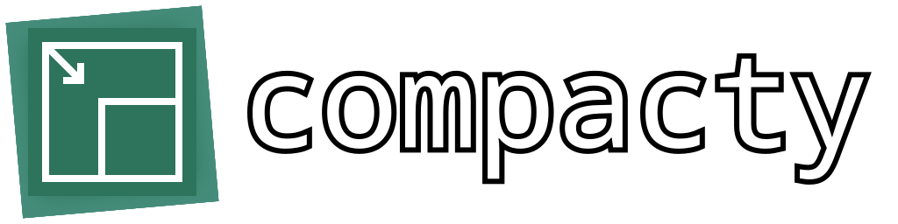

<div align="center">
  
</div>

**compacty** is a configurable command-line tool that compresses files (currently only PNGs, JPEGs, GIFs by default) by running them through multiple compression tools at once, and picking the best result. Inspired by [picopt](https://github.com/ajslater/picopt/), [optimizt](https://github.com/343dev/optimizt/), [Trimage](https://github.com/Kilian/Trimage), and [ImageOptim](https://github.com/ImageOptim/ImageOptim).

## ...why?
Every tool and every file is unique. **Which tool that gives the best compression on one file might be different on another.**

compacty was born out of a need in Roblox game development. In Roblox, assets are downloaded every time a player joins a game. Finding the best compression possible is thus crucial to reduce load times. However, manually testing a file against multiple compression tools is tedious. **compacty automates this process.** It runs your files through multiple compression tools simultaneously using a preset of arguments, and then returning the most optimal compression out of them.

compacty is also my first real shot at learning Go. I enjoyed it.

## installation

### prerequisites!
> [!IMPORTANT]
> compacty is a meta-tool that runs other compression tools. **compacty does not include nor bundle these tools by itself.** You must get the tools you wish to use separately and ensure that:
> - They're available in your system's `PATH`, or
> - The binary is placed in the same directory as compacty.

The default configuration uses the following tools:
- [Efficient Compression Tool (ECT)](https://github.com/fhanau/Efficient-Compression-Tool/)
- [imagemagick](https://imagemagick.org/)
- [pingo](https://css-ig.net/pingo/) (for Windows. To run this on Linux and MacOS you would need to install `wine`)
- [oxipng](https://github.com/shssoichiro/oxipng/)
- [pngout](http://www.advsys.net/ken/utils.html)
- [zopflipng](https://github.com/google/zopfli)
- [pngquant](https://pngquant.org/)
- [jpegoptim](https://github.com/tjko/jpegoptim/)
- jpegtran (a JPEG manipulation tool provided by [libjpeg](https://jpegclub.org/reference/reference-sources/), [libjpeg-turbo](https://github.com/libjpeg-turbo/libjpeg-turbo), or [mozjpeg](https://github.com/mozilla/mozjpeg/))
- [gifsicle](http://www.lcdf.org/gifsicle/)

### from releases
1. Navigate to the [Releases](https://github.com/ArrayNone/compacty/releases/) page
2. Download the binary appropriate for your operating system (Windows, MacOS, Linux)

### from source
Requires Go 1.24.4 or later.
```bash
go install github.com/ArrayNone/compacty/cmd/compacty@latest
```

## usage examples

```bash
# Run by using a specific preset
compacty --preset=lossy-highquality imageA.png imageB.jpeg

# Run by using the `default-preset` defined in your config file
compacty image.png

# List all of your tools and presets from the config file
compacty --list

# Generate a .tsv report after compressing for further analysis
# The reports are placed to the directory of the first file for each file format
# For example, this command will place the reports as ./report.png.tsv and ./Pictures/report.jpeg.tsv 
compacty --report imageA.png ./Pictures/imageB.jpeg ./Pictures/Photos/imageC.jpeg

# [EXPERIMENTAL] Measure the decoding time for each compression result using Go's native binaries 
# Only PNGs, JPEGs, and GIFs are supported
# (use `--keep-all` to save the results that have the fastest decode time)
compacty --decode-time imageA.png
```

Run `compacty --help` to see all available flags.

## configuration
compacty uses a `config.yaml` file that defines tools, presets, etc. On first run, a default configuration will be created in your user's config directory:
- Windows: `%APPDATA%\compacty\config.yaml`
- Linux: `~/.config/compacty/config.yaml`
- macOS: `~/Library/Application Support/compacty/config.yaml`

You can see the default configuration at [defaultconfig.go](./internal/config/defaultconfig.go). A more complete configuration is available at [complete-config.yaml](./complete-config.yaml) that contains even more tools, ready to be copy-pasted.

In each tool's argument list, you can include (or reuse) arguments from other presets (that are part of the same tool) by using the syntax `@preset-name`. For example:
```
pngout:
    description: Lossless PNG compressor. http://www.advsys.net/ken/utils.html
    command: pngout
    platform: [windows, darwin, linux]
    supported-formats: [image/png]
    output-mode: input-output
    arguments:
      default-args: ["-force", "-y"]
      lossless-loweffort: ["@default-args", "-s3"]
      lossless-higheffort: ["@default-args", "-s1"]
      lossless-maxbrute: ["@default-args", "-s0"]
      ...
```
During runtime, `lossless-loweffort` will be resolved to `["-force", "-y", "-s3"]`, `lossless-higheffort` will be resolved to `["-force", "-y", "-s1"]`, and so on. This is pretty handy to deduplicate flags that are there for setup (for example: forcing the tools to overwrite files), but can also be used to mix-and-match arguments. Note that circular includes are not allowed.

Your `config.yaml` will be validated on startup to check for inconsistencies and potential problems. See `Validate()` in [config.go](./internal/config/config.go) for all checks.

## licensing
compacty is licensed under the MIT License. See the [LICENSE](./LICENSE) file for more information.
